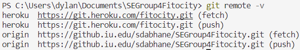

# SEGroup4Fitocity

## Deploying to `prod`

1) Ensure the backend and frontend servers work as expected with localhost:5000 and localhost:3000 respectively on the `main `branch.
2) Merge the changes into the `prod` branch.
3) Replace `localhost:3000` with `fitocity.herokuapp.com `in `/server/Routes/auth.js`
4) Replace `http` with `https `in `/server/Routes/auth.js`
5) Replace instances of `http://localhost:3000` with `https://fitocity.herokuapp.com` (don't replace in `README.md`)
6) Replace instances of `http://localhost:5000` with `https://fitocity.herokuapp.com` (don't replace in `README.md`)
7) Create a new commit
8) Run `git push heroku prod:main` (this assumes you have a remote pointing to the fitocity heroku repo, see bolow image)

   
